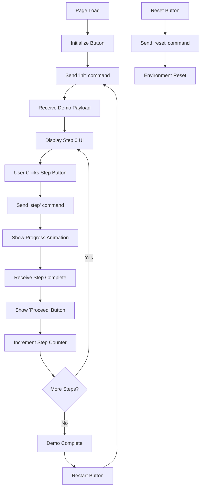

# Frontend System Specification: Stream Workflow Demo

## Overview
This document outlines the WebSocket-based stream workflow system for the front-end engineer. The system manages a multi-step demo process with real-time progress tracking and CRM integration.

## Technology Stack
- **Framework**: Next.js
- **UI Components**: Shadcn/ui blocks
- **Communication**: WebSocket connection to backend
- **State Management**: React state for step tracking and demo data

## System Architecture

### WebSocket Connection
- **URL**: `ws://localhost:8080` (or production URL)
- **Protocol**: JSON message-based communication
- **Connection**: Persistent throughout demo session

## Command Flow Overview



## WebSocket Commands & Responses

### 1. Reset Command (Standalone)
**Purpose**: Wipes all records and generates dummy data

```javascript
// Send to server
{
  type: 'reset'
}

// Server response
{
  type: 'resetComplete',
  message: 'Reset Complete - Records wiped and dummy Records Generated'
}
```

### 2. Init Command 
**Purpose**: Initialize stream workflow and get demo configuration

```javascript
// Send to server
{
  type: 'init'
}

// Server responses (multiple messages)
{
  type: 'status',
  message: 'Initializing stream records...'
}

{
  type: 'demoPayload',
  payload: [
    {
      title: "Salley Scanner gets added to Lendex",
      description: "Sally Scanner is added to Lendex. Here identity is now being resolved...",
      "user-prompt": "Have 2 Sally Scanners open in the browser. After you click the button, refresh only one to compare",
      "button-text": "Scan",
      img: "",
      process: [
        {
          text: "Detected contact 'Sally Scanner'",
          "run-time": 3,
          img: ""
        },
        {
          text: "'Sally Scanner' approved by Lendex for monitoring",
          "run-time": 3,
          img: ""
        }
        // ... more process items
      ]
    },
    {
      title: "Michael and Mike Merge in the system",
      description: "Michael and his doppleganger, Mike, are in fact the same person...",
      "button-text": "Merge",
      // ... similar structure
    }
    // ... more steps
  ]
}

{
  type: 'status',
  message: 'Stream workflow initialized. Awaiting step commands.'
}
```

### 3. Step Command
**Purpose**: Execute a specific step in the demo

```javascript
// Send to server
{
  type: 'step',
  stepNumber: 0  // Current step index
}

// Server responses
{
  type: 'status',
  message: 'Processing step 0...'
}

{
  type: 'stepComplete',
  stepNumber: 0,
  message: 'Step 0 Complete'
}

// OR on error
{
  type: 'stepError',
  stepNumber: 0,
  message: 'Error message details'
}
```

## UI Components & Layout

### 1. Page Structure
```jsx
// Main layout using Shadcn components
<div className="container mx-auto p-6">
  <ResetButton />
  <DemoContainer />
</div>
```

### 2. Reset Button (Always Visible)
```jsx
// Separate, prominent reset button
<Button 
  variant="destructive" 
  className="mb-4"
  onClick={handleReset}
>
  Reset Environment
</Button>
```

### 3. Demo Container States

#### A. Initial State (Page Load)
```jsx
<Card>
  <CardHeader>
    <CardTitle>Stream Workflow Demo</CardTitle>
    <CardDescription>
      Initialize the demo environment to begin the workflow process
    </CardDescription>
  </CardHeader>
  <CardContent>
    <div className="flex justify-center">
      <Button onClick={handleInit}>Initialize Demo</Button>
    </div>
  </CardContent>
</Card>
```

#### B. Step Display State
```jsx
<Card>
  <CardHeader>
    <CardTitle>{currentStep.title}</CardTitle>
    <CardDescription>{currentStep.description}</CardDescription>
    {currentStep.img && }
  </CardHeader>
  <CardContent>
    <p className="mb-4">{currentStep["user-prompt"]}</p>
    <Button onClick={handleStepExecution}>
      {currentStep["button-text"]}
    </Button>
  </CardContent>
</Card>
```

#### C. Progress State
```jsx
<Card>
  <CardHeader>
    <CardTitle>Processing...</CardTitle>
  </CardHeader>
  <CardContent>
    {currentStep.process.map((processItem, index) => (
      <div key={index} className="mb-4">
        <div className="flex items-center mb-2">
          {processItem.img && (
            
          )}
          <span className="text-sm">{processItem.text}</span>
        </div>
        <Progress 
          value={progressValues[index]} 
          className="w-full"
        />
      </div>
    ))}
  </CardContent>
</Card>
```

#### D. Demo Complete State
```jsx
<Card>
  <CardHeader>
    <CardTitle>Demo Complete</CardTitle>
    <CardDescription>
      All workflow steps have been completed successfully
    </CardDescription>
  </CardHeader>
  <CardContent>
    <Button onClick={handleRestart}>
      Restart Demo
    </Button>
  </CardContent>
</Card>
```

## State Management

### React State Structure
```javascript
const [connectionState, setConnectionState] = useState('disconnected'); // 'disconnected', 'connecting', 'connected'
const [demoState, setDemoState] = useState('initial'); // 'initial', 'initialized', 'processing', 'complete'
const [currentStepIndex, setCurrentStepIndex] = useState(0);
const [demoData, setDemoData] = useState(null);
const [progressValues, setProgressValues] = useState([]);
const [isProcessing, setIsProcessing] = useState(false);
const [logs, setLogs] = useState([]);
```

### Current Step Helper
```javascript
const currentStep = demoData ? demoData[currentStepIndex] : null;
const isLastStep = currentStepIndex === (demoData?.length - 1);
```

## Progress Animation Logic

### Progress Bar Animation
```javascript
const animateProgress = (processItems) => {
  const newProgressValues = new Array(processItems.length).fill(0);
  setProgressValues(newProgressValues);
  
  let currentProcessIndex = 0;
  
  const animateNextProcess = () => {
    if (currentProcessIndex >= processItems.length) {
      // All animations complete, wait for server response
      return;
    }
    
    const currentProcess = processItems[currentProcessIndex];
    const duration = currentProcess["run-time"] * 1000; // Convert to milliseconds
    const startTime = Date.now();
    
    const animate = () => {
      const elapsed = Date.now() - startTime;
      const progress = Math.min((elapsed / duration) * 100, 100);
      
      setProgressValues(prev => {
        const newValues = [...prev];
        newValues[currentProcessIndex] = progress;
        return newValues;
      });
      
      if (progress < 100) {
        requestAnimationFrame(animate);
      } else {
        currentProcessIndex++;
        if (currentProcessIndex < processItems.length) {
          animateNextProcess();
        } else {
          // All process items complete, show final bar at 90% until server responds
          setProgressValues(prev => {
            const newValues = [...prev];
            newValues[newValues.length - 1] = 90;
            return newValues;
          });
        }
      }
    };
    
    animate();
  };
  
  animateNextProcess();
};
```

### Server Response Handling
```javascript
// When server responds with stepComplete
const handleStepComplete = () => {
  // Complete final progress bar
  setProgressValues(prev => {
    const newValues = [...prev];
    newValues[newValues.length - 1] = 100;
    return newValues;
  });
  
  // Show "Proceed" button after brief delay
  setTimeout(() => {
    setDemoState('stepComplete');
  }, 500);
};
```

## WebSocket Event Handlers

### Connection Management
```javascript
const connectWebSocket = () => {
  const ws = new WebSocket('ws://localhost:8080');
  
  ws.onopen = () => {
    setConnectionState('connected');
    console.log('WebSocket connected');
  };
  
  ws.onmessage = (event) => {
    const data = JSON.parse(event.data);
    handleWebSocketMessage(data);
  };
  
  ws.onclose = () => {
    setConnectionState('disconnected');
    console.log('WebSocket disconnected');
  };
  
  ws.onerror = (error) => {
    console.error('WebSocket error:', error);
  };
  
  return ws;
};
```

### Message Handling
```javascript
const handleWebSocketMessage = (data) => {
  switch (data.type) {
    case 'log':
      setLogs(prev => [...prev, data.message]);
      break;
      
    case 'status':
      console.log('Status:', data.message);
      break;
      
    case 'demoPayload':
      setDemoData(data.payload);
      setCurrentStepIndex(0);
      setDemoState('initialized');
      break;
      
    case 'stepComplete':
      handleStepComplete();
      break;
      
    case 'stepError':
      console.error('Step error:', data.message);
      setDemoState('error');
      break;
      
    case 'resetComplete':
      console.log('Reset complete');
      setDemoState('initial');
      setCurrentStepIndex(0);
      setDemoData(null);
      break;
      
    default:
      console.log('Unknown message type:', data.type);
  }
};
```

## Button Event Handlers

### Reset Handler
```javascript
const handleReset = () => {
  if (websocket?.readyState === WebSocket.OPEN) {
    websocket.send(JSON.stringify({ type: 'reset' }));
  }
};
```

### Initialize Handler
```javascript
const handleInit = () => {
  if (websocket?.readyState === WebSocket.OPEN) {
    setDemoState('initializing');
    websocket.send(JSON.stringify({ type: 'init' }));
  }
};
```

### Step Execution Handler
```javascript
const handleStepExecution = () => {
  if (websocket?.readyState === WebSocket.OPEN && currentStep) {
    setDemoState('processing');
    setIsProcessing(true);
    
    // Start progress animation
    animateProgress(currentStep.process);
    
    // Send step command to server
    websocket.send(JSON.stringify({
      type: 'step',
      stepNumber: currentStepIndex
    }));
  }
};
```

### Proceed Handler
```javascript
const handleProceed = () => {
  if (isLastStep) {
    setDemoState('complete');
  } else {
    setCurrentStepIndex(prev => prev + 1);
    setDemoState('initialized');
    setProgressValues([]);
  }
  setIsProcessing(false);
};
```

### Restart Handler
```javascript
const handleRestart = () => {
  setCurrentStepIndex(0);
  setDemoState('initializing');
  if (websocket?.readyState === WebSocket.OPEN) {
    websocket.send(JSON.stringify({ type: 'init' }));
  }
};
```

## Error Handling

### Connection Errors
```javascript
const handleConnectionError = () => {
  setConnectionState('disconnected');
  setDemoState('error');
  // Show reconnection UI
};
```

### Step Errors
```javascript
const handleStepError = (errorMessage) => {
  setIsProcessing(false);
  setDemoState('error');
  // Show error message to user
  // Provide retry option
};
```

## Shadcn Components Required

- `Button` - Various action buttons
- `Card`, `CardHeader`, `CardTitle`, `CardDescription`, `CardContent` - Layout structure
- `Progress` - Progress bars for process animation
- `Badge` - Status indicators
- `Alert`, `AlertDescription` - Error messages
- `Separator` - Visual separation
- `Skeleton` - Loading states

## Implementation Notes

1. **Media Generation**: For initialization state, generate placeholder images/icons using a service like Unsplash or create simple SVG icons
2. **Progress Animation**: Use `requestAnimationFrame` for smooth progress bar animations
3. **State Persistence**: Consider using localStorage to persist demo state across page refreshes
4. **Responsive Design**: Ensure components work well on mobile devices
5. **Accessibility**: Include proper ARIA labels and keyboard navigation
6. **Error Recovery**: Implement retry mechanisms for failed operations

## Testing Considerations

- Test WebSocket connection handling (connect, disconnect, reconnect)
- Test progress animation timing and synchronization
- Test error states and recovery
- Test step progression and completion
- Test reset functionality
- Test responsive behavior on different screen sizes 